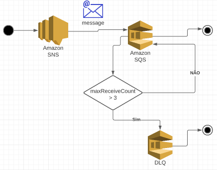

# AWS SNS - SQS subscription with DLQ

### SNS Message via AWS CLI:
``` bash
aws sns publish \
  --topic-arn "TOPIC-ARN" \
  --message '{"key1":"value1", "key2":"value2"}' \
  --profile "PROFILE-NAME"\
  --region "REGION"
```

### Estrutura Construída:



### Links:
- [Terraform: aws_sns_topic](https://registry.terraform.io/providers/hashicorp/aws/latest/docs/resources/sns_topic)
- [Terraform: aws_sqs_queue](https://registry.terraform.io/providers/hashicorp/aws/latest/docs/resources/sqs_queue)
- [AWS JSON policy elements: Principal](https://docs.aws.amazon.com/IAM/latest/UserGuide/reference_policies_elements_principal.html)
- [Amazon SQS security best practices](https://docs.aws.amazon.com/AWSSimpleQueueService/latest/SQSDeveloperGuide/sqs-security-best-practices.html)
- [Example cases for Amazon SNS access control](https://docs.aws.amazon.com/sns/latest/dg/sns-access-policy-use-cases.html)
- [sqs-dead-letter-queues](https://docs.aws.amazon.com/AWSSimpleQueueService/latest/SQSDeveloperGuide/sqs-dead-letter-queues.html)